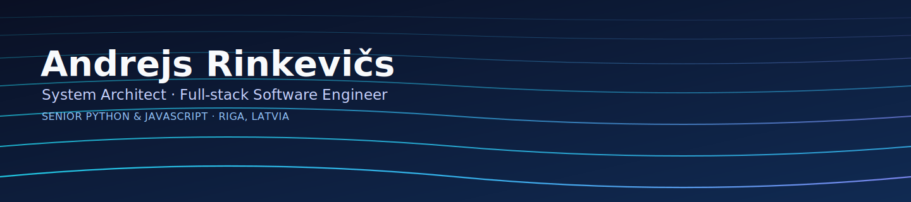

  

  

  📍 Riga, Latvia &nbsp;·&nbsp; 🧩 Startup-minded &nbsp;·&nbsp; ☁️ AWS &nbsp;·&nbsp; 🏗️ Solution Architecture

## 👋 About me

Result-oriented, startup-minded **system architect** and **full-stack software engineer** with 10+ years turning ideas into production products. I define architecture and migration paths, then build the services and UIs on top — from WebRTC conferencing and high-reliability data access (11 nines) to payment platforms and content systems.

- 🏗️ System & solution architecture · MVP-to-production
- 🐍 **Senior Python** (Django / DRF) · 🟨 **Senior JavaScript / TypeScript** (React / Next.js)
- ☁️ AWS · Docker · Linux · NGINX · CI/CD & automation

## 🛠️ Tech Stack

## 🤝 Let's work together

Have an idea but no path to production? I architect it and build it — end to end. Get in touch and let's ship it.

  
  
  
  

